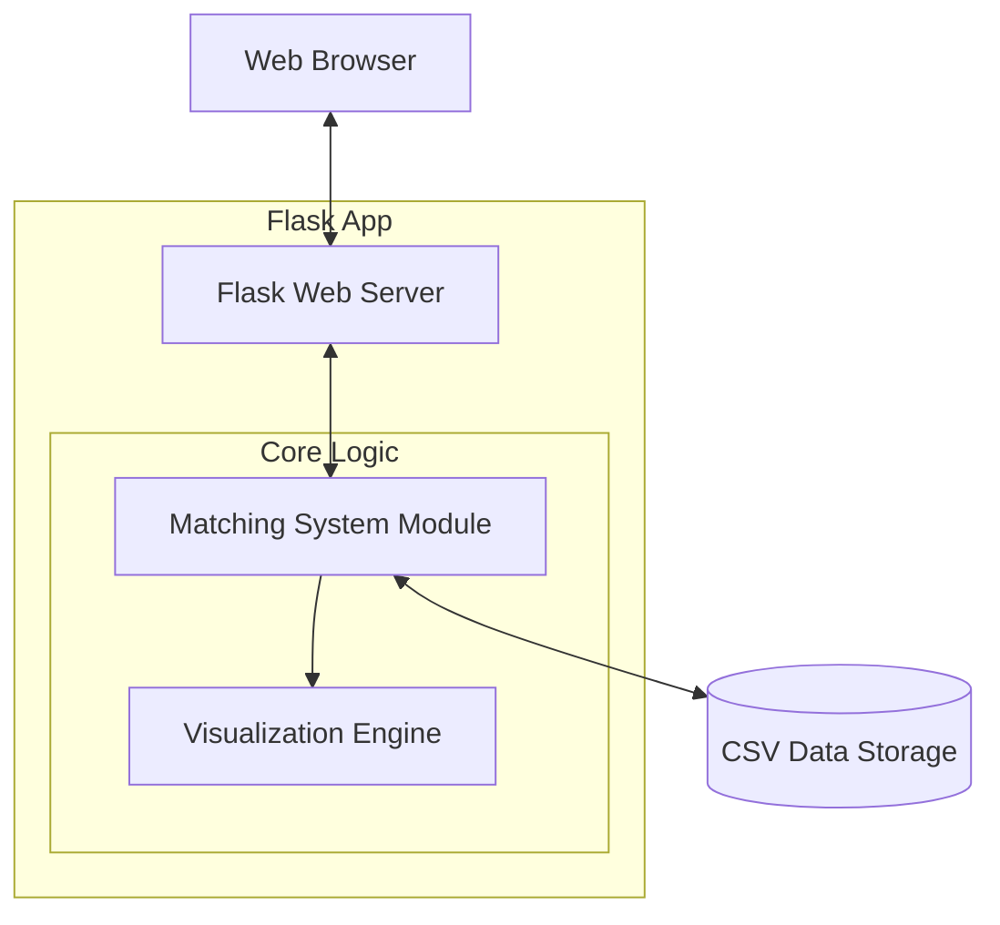
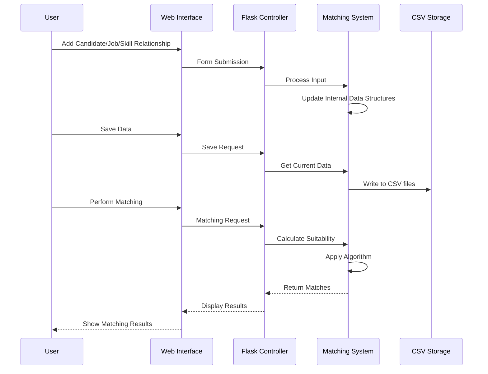
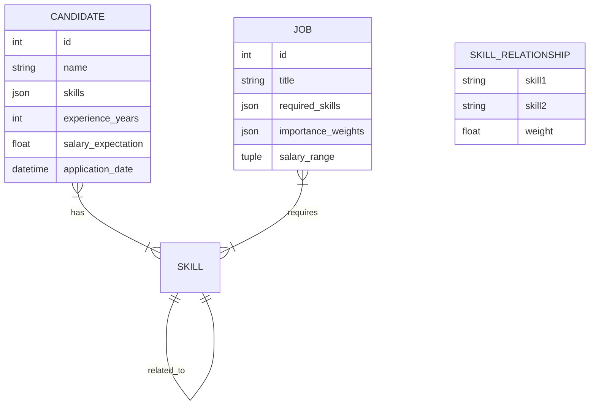
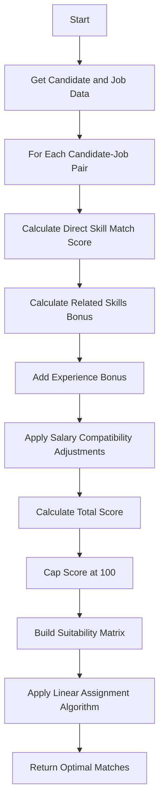
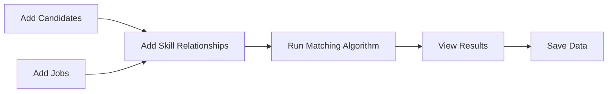

# Resume-Job Matching System Documentation

## System Overview

The Resume-Job Matching System is a web application that helps match job candidates with job openings based on their skills, experience, and salary expectations. The system uses a sophisticated scoring algorithm that considers direct skill matches, related skills through a skill relationship graph, experience bonuses, and salary compatibility.

## Table of Contents

1. [System Architecture](#system-architecture)
2. [Data Flow](#data-flow)
3. [Component Descriptions](#component-descriptions)
4. [Database Structure](#database-structure)
5. [Matching Algorithm](#matching-algorithm)
6. [User Guide](#user-guide)
7. [API Reference](#api-reference)

## System Architecture

The system uses a Flask-based web application architecture with a modular design:

The application follows an MVC-like pattern:
- **Model**: Matching System class managing candidates, jobs, and skill relationships
- **View**: HTML templates with Bootstrap styling
- **Controller**: Flask routes handling user requests

## Data Flow

The following diagram illustrates the data flow in the application:

## Component Descriptions

### Matching System

The core engine of the application, responsible for:
- Managing candidates and their skills, experience, and salary expectations
- Managing job listings with required skills and salary ranges
- Building and querying the skill relationship graph
- Calculating suitability scores between candidates and jobs
- Generating optimal matches using linear assignment algorithm

### Web Interface

Built with Flask, Bootstrap, and JavaScript, providing:
- Intuitive forms for adding and managing data
- Interactive visualizations of matching results
- Toggle between different views for the suitability matrix
- Responsive design for desktop and mobile use

### Data Persistence

Uses CSV files for data storage:
- `candidates.csv`: Stores candidate profiles
- `jobs.csv`: Stores job listings
- `skills.csv`: Stores skill relationships

## Database Structure

The system uses a file-based database with the following structure:

## Matching Algorithm

The matching algorithm uses several components to calculate suitability scores:

### Scoring Components

1. **Direct Skill Match**: Multiply candidate's skill level by job's importance weight
2. **Related Skills Bonus**: Calculate partial scores for skills related through the skill graph
3. **Experience Bonus**: Add up to 5 points based on years of experience
4. **Salary Penalty**: Deduct points if candidate's salary expectation exceeds job's maximum

## User Guide

### Basic Workflow

### Detailed Steps

1. **Add Candidates**:
   - Navigate to the Candidates page
   - Click "Add Candidate"
   - Fill in candidate details, including skills with proficiency levels

2. **Add Jobs**:
   - Navigate to the Jobs page
   - Click "Add Job"
   - Specify job details, including required skills with importance weights

3. **Define Skill Relationships**:
   - Navigate to the Skills page
   - Create relationships between related skills
   - Define the relationship strength (lower values = stronger relationship)

4. **Run Matching**:
   - Go to the Matching page
   - Set the minimum score threshold
   - Click "Run Matching"
   - View results in heatmap or table format

5. **Save Data**:
   - Click "Save Data" in the navigation bar to preserve your work

## API Reference

### Matching System Class

Key methods of the `ResumeMatchingSystem` class:

| Method | Description | Parameters | Return Value |
|--------|-------------|-----------|--------------|
| `add_candidate()` | Add a candidate to the system | `candidate_id`, `name`, `skills`, `experience_years`, `salary_expectation` | `candidate_id` |
| `add_job()` | Add a job to the system | `job_id`, `title`, `required_skills`, `importance_weights`, `salary_range` | `job_id` |
| `add_skill_relationship()` | Create a relationship between two skills | `skill1`, `skill2`, `weight` | None |
| `calculate_suitability_scores()` | Calculate matrix of candidate-job scores | None | Numpy array |
| `find_optimal_matches()` | Find optimal assignment of candidates to jobs | None | List of matches |
| `generate_report()` | Create a detailed match report | `matches` (optional) | Pandas DataFrame |
| `visualize_suitability()` | Create heatmap visualization | `return_base64`, `show_annotations` | Base64 string or display plot |
| `get_suitability_as_html()` | Create HTML table of scores | None | HTML string |
| `save_suitability_to_csv()` | Save scores to CSV file | `filename` | None |

### Flask Routes

| Route | Method | Description |
|-------|--------|-------------|
| `/` | GET | Dashboard with system statistics |
| `/candidates` | GET, POST | View and add candidates |
| `/candidates/delete/<candidate_id>` | POST | Delete a candidate |
| `/jobs` | GET, POST | View and add jobs |
| `/jobs/delete/<job_id>` | POST | Delete a job |
| `/skills` | GET, POST | View and add skill relationships |
| `/matching` | GET, POST | Run matching algorithm and view results |
| `/save_data` | POST | Save all data to CSV files |