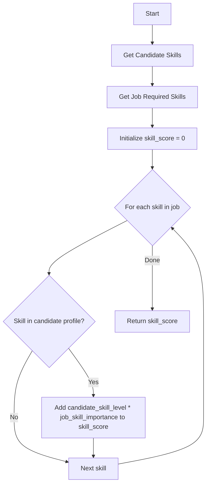
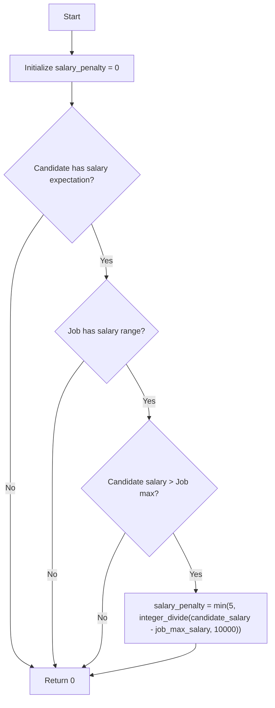
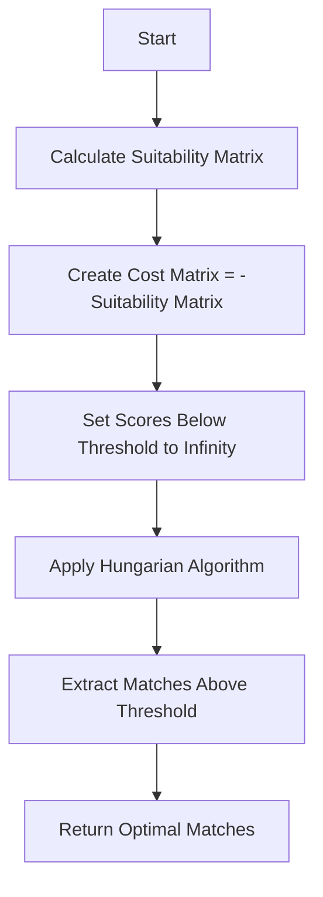

# Matching Algorithm Documentation

## Overview

The Resume-Job Matching System uses a sophisticated algorithm to calculate suitability scores between candidates and jobs. This document provides detailed information about how the algorithm works.

## Algorithm Components

### 1. Direct Skill Matching

For each candidate-job pair, we compare the candidate's skills with the job's required skills:



Formula:
```
skill_score = Σ(candidate_skill_level[skill] * job_importance_weight[skill]) for all matching skills
```

Where:
- `candidate_skill_level` ranges from 1-10
- `job_importance_weight` is typically 0.1-10

### 2. Related Skills Bonus

The system calculates bonuses for related skills using a skill relationship graph:

```mermaid
graph TD
    A[Start] --> B[Initialize related_bonus = 0]
    B --> C{For each required job skill}
    C --> D{Candidate has skill?}
    D -- Yes --> E[Skip to next skill]
    D -- No --> F{For each candidate skill}
    F --> G{Path exists between candidate skill and job skill?}
    G -- No --> H[Next candidate skill]
    G -- Yes --> I[Calculate path length]
    I --> J[Calculate bonus = candidate_skill_level * (1 / (1 + path_length)) * 0.5]
    J --> K[Add bonus to related_bonus]
    K --> H
    H --> F
    F -- Done --> L[Next job skill]
    L --> C
    C -- Done --> M[Return related_bonus]
```

Formula:

related_bonus = Σ(candidate_skill_level[cand_skill] * (1 / (1 + path_length)) * 0.5)


Where:
- `path_length` is the shortest path in the skill graph
- The multiplier `0.5` reduces the weight compared to direct matches

### 3. Experience Bonus

The system awards bonus points for years of experience:

```
exp_bonus = min(candidate.experience_years, 5)
```

This caps the experience bonus at 5 points.

### 4. Salary Compatibility Adjustment

A penalty is applied if the candidate's salary expectation exceeds the job's maximum:



Formula:
```
salary_penalty = min(5, (candidate_salary - job_max_salary) // 10000) if candidate_salary > job_max_salary else 0
```

This applies a 1-point penalty for each $10,000 above the maximum, capped at 5 points.

### 5. Total Score Calculation

The final suitability score combines all components:

```
total_score = skill_score + related_bonus + exp_bonus - salary_penalty
```

The score is then capped to a maximum of 100:

```
final_score = min(100, max(0, total_score))
```

## Optimal Matching Algorithm

After calculating the suitability matrix, the system uses the Hungarian algorithm (linear assignment) to find the optimal matching:



This ensures that:
1. The sum of all assignment scores is maximized
2. Each candidate is matched with at most one job
3. Each job is matched with at most one candidate
4. Only matches above the threshold are considered

## Score Interpretation

| Score Range | Interpretation |
|-------------|---------------|
| 80-100 | Excellent match |
| 60-79 | Strong match |
| 40-59 | Good match |
| 20-39 | Moderate match |
| 0-19 | Poor match |